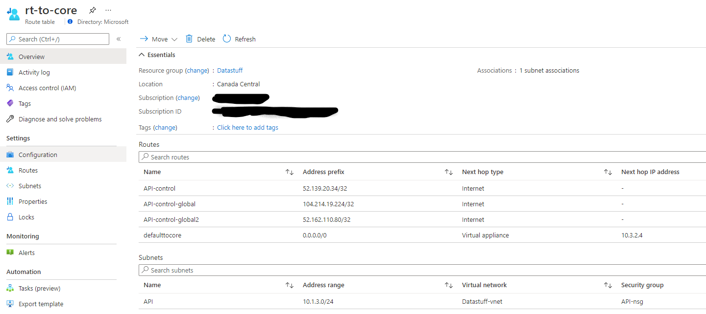

# APIM and Networks

## Attribution
Much of this information is from the product doc pages, but a lot of the detail comes from the following pages, excellent information on this topic.

[API Management - Networking FAQs (Demystifying Series I)](https://techcommunity.microsoft.com/t5/azure-paas-blog/api-management-networking-faqs-demystifying-series-i/ba-p/1500996#NSG6)

[API Management - Networking FAQs (Demystifying Series II)](https://techcommunity.microsoft.com/t5/azure-paas-blog/api-management-networking-faqs-demystifying-series-ii/ba-p/1502056)

# Deployment

For the "internal only" VNet model which is the model that we expect most security sensitive departments to choose, there are many [advantages](https://docs.microsoft.com/en-us/azure/api-management/api-management-using-with-internal-vnet).

The requirements for this kind of deployment include allowing some network traffic to flow in ways that does not align with the hub and spoke model.  The specifics are well covered in the [documentation](https://docs.microsoft.com/en-us/azure/api-management/api-management-using-with-internal-vnet#--routing), but specifically:

- For the subnet that you are installing APIM to, enable service endpoints to:

    - Azure SQL
    - Azure Storage
    - Azure Eventhub
    - Azure Servicebus

- The API subnet route table needs to have a direct route to the control IPs.  This is the traffic pattern that runs against the usual hub and spoke flows.  The APIM service needs a direct path to the control plane addresses, as shown below.  The actual addresses used here will vary, use the regional addresses as necessary, [found here](https://docs.microsoft.com/en-us/azure/api-management/api-management-using-with-vnet#--control-plane-ip-addresses).

