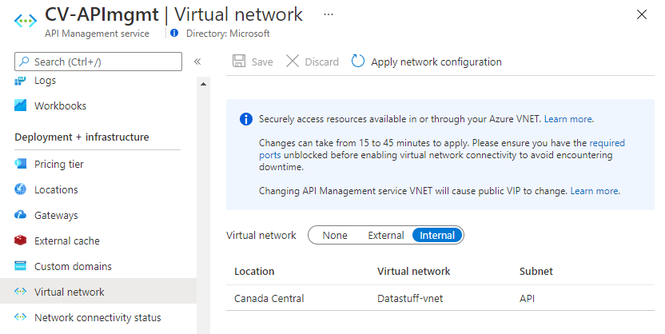
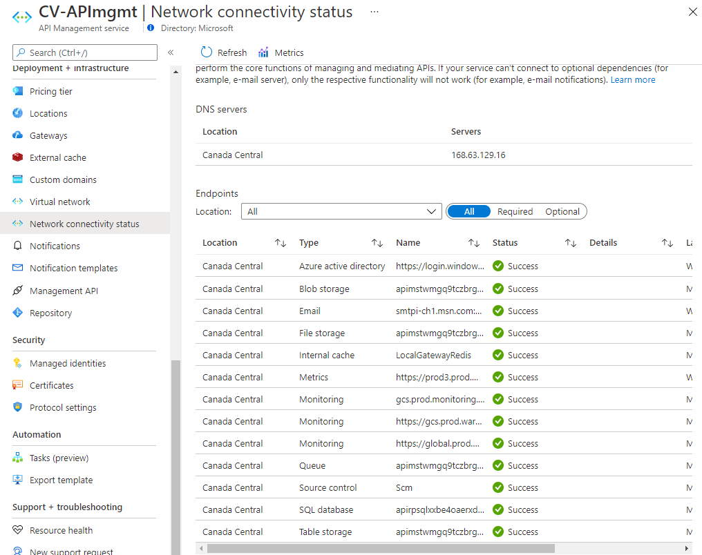

# GC-DesignPatterns

Most GC customers will be able to use patterns that are well described and documented in other areas, such as the Azure Architecture center.

Key elements of application design that generally work well in Canadian Government departments are:
- hub spoke VNet arrangements for IaaS workloads
- symmetric network routing requirements (see below)

Some workloads do not immediately lend themselves to these legacy models, and while they most often would be considered PaaS, there is enough overlap to cause confusion for some.

### API Management 
Not to describe what this resource does, but it does have some unique networking requirements and especially when it is to be used as much as possible inside a customer created VNet.

The most common desire is to have everything contained inside a network, and control everything.  API Management can be deployed to a VNET in the "internal" mode, where most of the associated assets are contained in a VNET.

If everything is good, the status should look green.

### Azure Data Bricks

